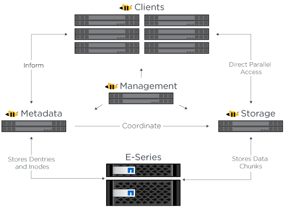
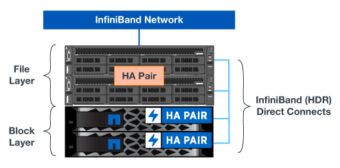
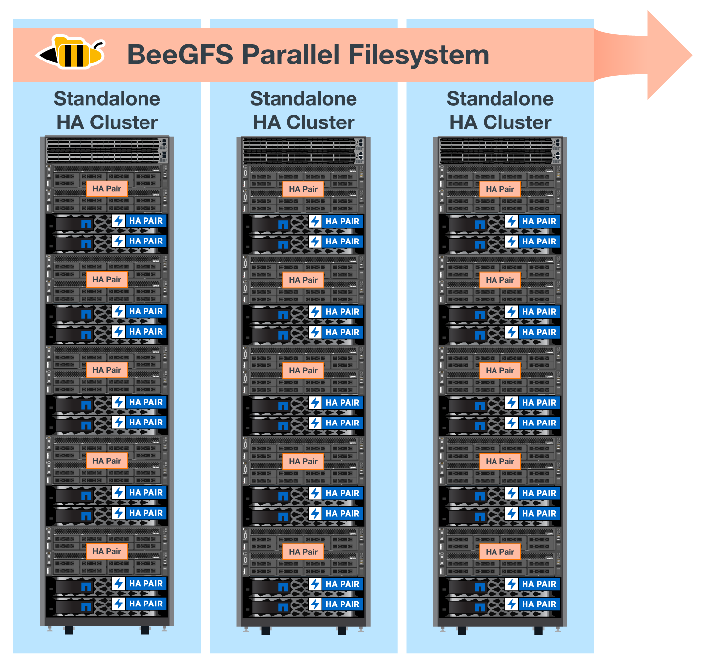
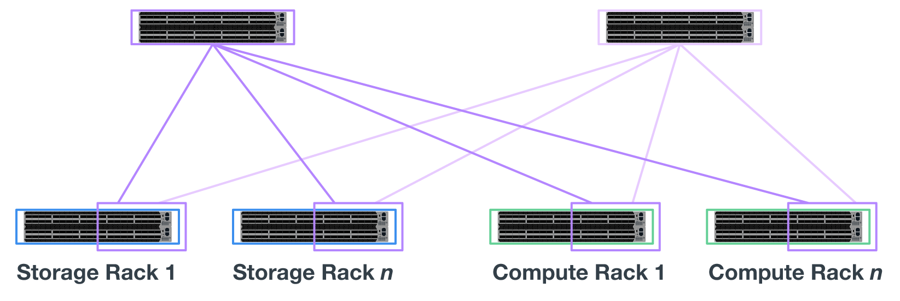

= 架構總覽
:hardbreaks:
:allow-uri-read: 
:nofooter: 
:icons: font
:linkattrs: 
:imagesdir: ./media/

[role="lead"]
NetApp上的BeeGFS解決方案包含架構設計考量、可用來判斷支援已驗證工作負載所需的特定設備、纜線和組態。

== 建置區塊架構

BeeGFS檔案系統可根據儲存需求以不同方式進行部署和擴充。例如、主要包含大量小型檔案的使用案例、將可從額外的中繼資料效能和容量中獲益、而較少大型檔案的使用案例、則可能會讓實際檔案內容的儲存容量和效能更高。這些多重考量因素會影響平行檔案系統部署的不同層面、進而增加設計和部署檔案系統的複雜度。

為了因應這些挑戰、NetApp設計了標準建置區塊架構、用於橫向擴充這些層面。通常、BeeGFS建置區塊會部署在三種組態設定檔中的其中一種：

* 單一基礎建置區塊、包括BeeGFS管理、中繼資料和儲存服務
* BeeGFS中繼資料加上儲存建置區塊
* BeeGFS僅儲存建置區塊

這三個選項之間唯一的硬體變更是使用較小的磁碟機來處理BeeGFS中繼資料。否則、所有組態變更都會透過軟體套用。使用Ansible做為部署引擎、為特定建置區塊設定所需的設定檔、可讓組態工作變得簡單明瞭。

如需詳細資料、請參閱  hardware design。

== 檔案系統服務

BeeGFS檔案系統包含下列主要服務：

* *管理服務。*註冊並監控所有其他服務。
* *儲存服務。*儲存稱為資料區塊檔案的分散式使用者檔案內容。
* *中繼資料服務。*會追蹤檔案系統配置、目錄、檔案屬性等。
* *用戶端服務。*掛載檔案系統以存取儲存的資料。

下圖顯示了與NetApp E系列系統搭配使用的BeeGFS解決方案元件和關係。

作為平行檔案系統、BeeGFS會將其檔案等量磁碟區化到多個伺服器節點上、以最大化讀寫效能和擴充性。伺服器節點可共同運作、提供單一檔案系統、讓其他伺服器節點（通常稱為_Clients_）同時掛載及存取。這些用戶端可以像NTFS、XFS或ext4等本機檔案系統一樣、查看及使用分散式檔案系統。

這四項主要服務可在多種支援的Linux套裝作業系統上執行、並可透過任何支援TCP/IP或RDMA的網路進行通訊、包括InfiniBand（IB）、OMNI-Path（opa）和RDMA over Converged Ethernet（roce）。BeeGFS伺服器服務（管理、儲存及中繼資料）是使用者空間精靈、而用戶端則是原生核心模組（無修補程式）。所有元件均可在不重新開機的情況下安裝或更新、而且您可以在同一個節點上執行任何服務組合。

== 已驗證節點

NetApp上的BeeGFS解決方案包含下列通過驗證的節點：NetApp EF600儲存系統（區塊節點）和Lenovo ThinkSystem SR665 Server（檔案節點）。

=== 區塊節點：EF600儲存系統

NetApp EF600 All Flash Array提供一致、近乎即時的資料存取、同時支援任意數量的工作負載。EF600儲存系統為AI和HPC應用程式提供快速且持續的資料饋送功能、可在單一機箱中提供高達200萬個快取讀取IOPS、100微秒以下的回應時間、以及42GBps循序讀取頻寬。

=== 檔案節點：Lenovo ThinkSystem SR665伺服器

SR665是雙插槽2U伺服器、搭載PCIe 4.0。當設定為符合此解決方案的需求時、它可提供充分的效能、在組態中執行BeeGFS檔案服務、並與直接附加E系列節點所提供的處理量和IOPs的可用度保持良好平衡。

如需Lenovo SR665的詳細資訊、請參閱 https://lenovopress.com/lp1269-thinksystem-sr665-server["聯想的網站"^]。

== 已驗證硬體設計

解決方案的建置區塊（如下圖所示）使用雙插槽PCIe 4.0伺服器作為BeeGFS檔案層、使用兩個EF600儲存系統作為區塊層。

NOTE: 由於每個建置區塊都包含兩個BeeGFS檔案節點、因此在容錯移轉叢集中建立仲裁所需的建置區塊至少要有兩個。雖然您可以設定雙節點叢集、但此組態具有限制、可能會導致容錯移轉失敗。如果您需要雙節點叢集、可以將第三個裝置整合為斷路器（不過、此站台並未涵蓋該設計）。

每個建置區塊都能透過雙層硬體設計、將檔案層和區塊層的故障網域區隔開來、提供高可用度。每個層級都能獨立容錯移轉、提供更高的恢復能力、並降低串聯故障的風險。搭配NVMeoF使用HDRInfiniBand可在檔案和區塊節點之間提供高處理量和最低延遲、並提供完整備援和足夠的連結超額訂閱、以避免分散式設計成為瓶頸、即使系統部分降級。

NetApp上的BeeGFS解決方案可在部署中的所有建置區塊上執行。部署的第一個建置區塊必須執行BeeGFS管理、中繼資料和儲存服務（稱為基礎建置區塊）。所有後續的建置區塊都是透過軟體設定、以執行BeeGFS中繼資料和儲存服務、或僅執行儲存服務。每個建置區塊的不同組態設定檔可用度、可利用相同的基礎硬體平台和建置區塊設計來擴充檔案系統中繼資料或儲存容量和效能。

獨立式Linux HA叢集最多可合併五個建置區塊、確保每個叢集資源管理程式（起搏器）擁有合理數量的資源、並減少維持叢集成員同步所需的訊息傳輸負荷（電暈器同步）。建議每個叢集至少有兩個建置區塊、以允許足夠的成員建立仲裁。其中一個或多個獨立式BeeGFS HA叢集會結合在一起、以建立一個BeeGFS檔案系統（如下圖所示）、可供用戶端作為單一儲存命名空間存取。

雖然每個機架的建置區塊數量最終取決於特定站台的電力和冷卻需求、 此解決方案的設計可在單一42U機架中部署最多五個建置區塊、同時仍可容納兩個用於儲存/資料網路的1U InfiniBand交換器。每個建置區塊都需要八個IB連接埠（每個交換器四個用於備援）、因此五個建置區塊會在40埠的HDRInfiniBand交換器（例如NVIDIA QM8700）上留下一半的連接埠、以供實作fat樹狀結構或類似的非區塊拓撲。這項組態可確保儲存設備或運算/GPU機架的數量能夠擴充、而不會產生網路瓶頸。或者、您也可以根據儲存架構廠商的建議、使用超額訂閱的儲存架構。

下圖顯示80節點的fat樹狀結構拓撲。

藉由使用Ansible做為部署引擎、在NetApp上部署BeeGFS、系統管理員可以使用現代化的基礎架構做為程式碼實務、來維護整個環境。如此可大幅簡化原本複雜的系統、讓系統管理員能夠在同一個位置定義及調整組態、無論環境的規模有多大、都能確保系統一致地套用組態。BeeGFS系列可從取得 https://galaxy.ansible.com/netapp_eseries/beegfs["Ansible Galaxy"^] 和 https://github.com/netappeseries/beegfs/["NetApp的E系列GitHub"^]。
