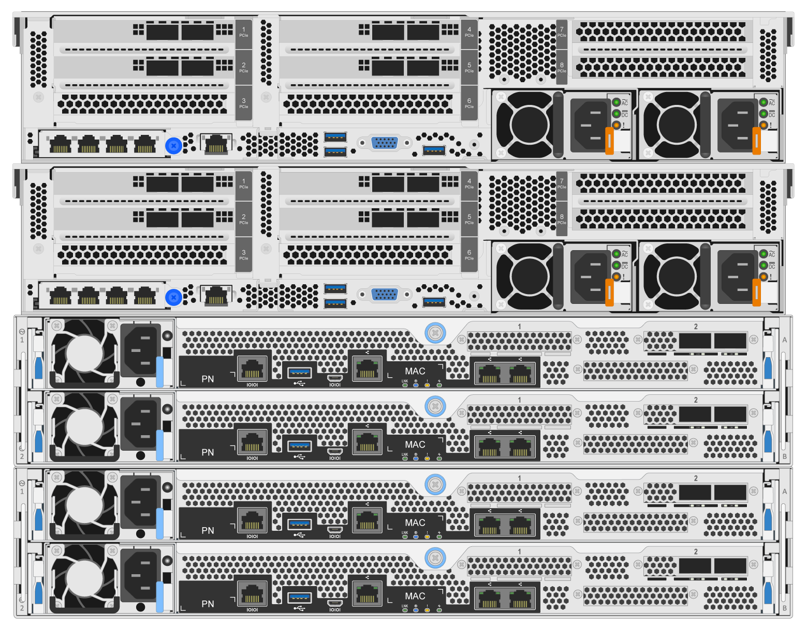
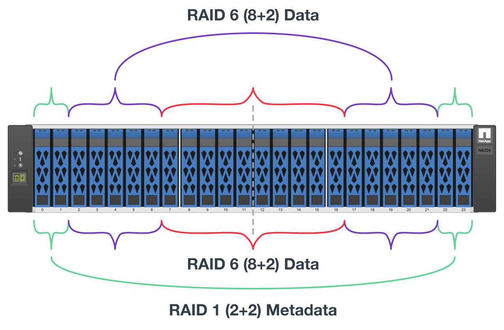
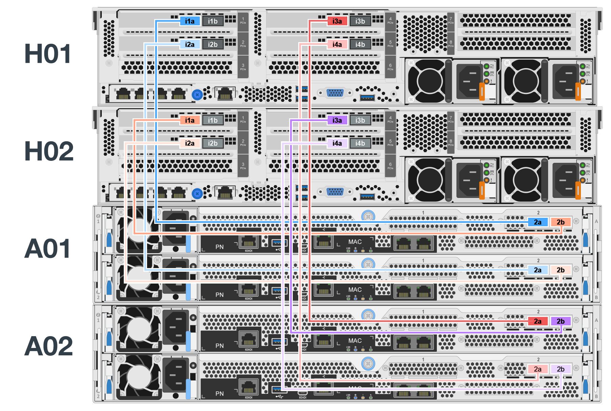

= 部署硬體
:hardbreaks:
:allow-uri-read: 
:nofooter: 
:icons: font
:linkattrs: 
:imagesdir: ./media/

[role="lead"]
每個建置區塊都包含兩個已驗證的x86檔案節點、這些節點使用HDR（200GB）InfiniBand纜線直接連接至兩個區塊節點。

NOTE: 在容錯移轉叢集中建立仲裁所需的建置區塊至少有兩個。雙節點叢集具有可能會阻止容錯移轉成功的限制。您可以將第三個裝置整合為 tiebreaker 來設定雙節點叢集、但本文件並未說明該設計。

下列步驟對於叢集中的每個建置區塊都是相同的、無論是用於執行 BeeGFS 中繼資料和儲存服務、還是僅用於儲存服務、除非另有說明。

.步驟
. 使用中指定的模型，設定每個 BeeGFS 檔案節點與四個主機通道介面卡 (HCAs) link:beegfs-technology-requirements.html["技術需求"]。根據下列規格、將 HCA 插入檔案節點的 PCIe 插槽：
+
** * Lenovo ThinkSystem SR665 V3 伺服器： * 使用 PCIe 插槽 1 、 2 、 4 和 5 。
** * Lenovo ThinkSystem SR665 伺服器： * 使用 PCIe 插槽 2 、 3 、 5 和 6 。

. 使用雙埠200GB主機介面卡（HIC）設定每個BeeGFS區塊節點、並在其兩個儲存控制器中的每個都安裝HIC。
+
將建置區塊架起、使兩個BeeGFS檔案節點在BeeGFS區塊節點上方。下圖顯示 BeeGFS 建置區塊的正確硬體組態、使用 Lenovo ThinkSystem SR665 V3 伺服器做為檔案節點（後視圖）。

+

+

NOTE: 生產使用案例的電源供應器組態通常應使用備援PSU。

. 如有需要、請在每個BeeGFS區塊節點中安裝磁碟機。
+
.. 如果建置區塊將用於執行BeeGFS中繼資料和儲存服務、而較小的磁碟機則用於中繼資料磁碟區、請確認它們已安裝在最外側的磁碟機插槽中、如下圖所示。
.. 對於所有的建置區塊組態、如果磁碟機機箱未完全安裝、請確定插槽0–11和12–23中已安裝相同數量的磁碟機、以獲得最佳效能。
+

. 使用連接區塊和檔案節點 link:beegfs-technology-requirements.html#block-file-cables["1M InfiniBand HDR 200GB 直接連接銅線"]、使它們符合下圖所示的拓撲。
+

+

NOTE: 橫跨多個建置區塊的節點永遠不會直接連線。每個建置區塊都應視為獨立式單元、而建置區塊之間的所有通訊都是透過網路交換器進行。

. 使用特定於 InfiniBand 儲存交換器的、將檔案節點上的其餘 InfiniBand 連接埠連接至儲存網路的 InfiniBand 交換 link:beegfs-technology-requirements.html#file-switch-cables["2 公尺 InfiniBand 纜線"] 器。
+
當使用分離器纜線將儲存交換器連接至檔案節點時、一條纜線應從交換器分支出來、並連接至淡綠色的連接埠。另一條分離器纜線應從交換器分支出來、並連接至暗綠色的連接埠。

+
此外、對於具有備援交換器的儲存網路、淡綠色的連接埠應連接至一台交換器、而深綠色的連接埠則應連接至另一台交換器。

+
image:../media/networkcable.png[""]

. 視需要、依照相同的佈線準則組裝其他建置組塊。
+

NOTE: 可部署在單一機架中的建置區塊總數、取決於每個站台可用的電力和冷卻。

