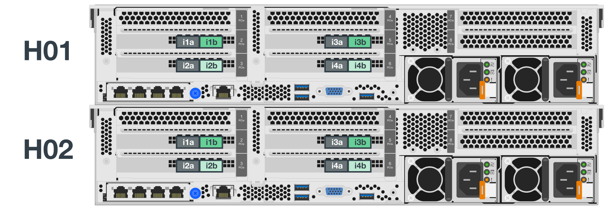

= 部署硬體
:hardbreaks:
:allow-uri-read: 
:nofooter: 
:icons: font
:linkattrs: 
:imagesdir: ./media/

[role="lead"]
每個建置區塊都包含兩個已驗證的x86檔案節點、這些節點使用HDR（200GB）InfiniBand纜線直接連接至兩個區塊節點。

NOTE: 由於每個建置區塊都包含兩個BeeGFS檔案節點、因此在容錯移轉叢集中建立仲裁所需的建置區塊至少要有兩個。雖然可以設定雙節點叢集、但此組態有一些限制、可能會在某些情況下導致容錯移轉失敗。如果需要雙節點叢集、也可以將第三個裝置整合為斷路器、但此部署程序並未涵蓋這一點。

除非另有說明、否則無論是用於執行BeeGFS中繼資料和儲存服務、或僅用於儲存服務、叢集中每個建置區塊的下列步驟都相同。

.步驟
. 以InfiniBand模式設定每個BeeGFS檔案節點、並在PCIe插槽2、3、5及6中安裝四個PCIe 4.0 ConnectX-6雙埠主機通道介面卡（HCA）。
. 使用雙埠200GB主機介面卡（HIC）設定每個BeeGFS區塊節點、並在其兩個儲存控制器中的每個都安裝HIC。
+
將建置區塊架起、使兩個BeeGFS檔案節點在BeeGFS區塊節點上方。下圖顯示BeeGFS建置區塊的正確硬體組態（後視圖）。

+
image:../media/buildingblock.png[""]

+

NOTE: 生產使用案例的電源供應器組態通常應使用備援PSU。

. 如有需要、請在每個BeeGFS區塊節點中安裝磁碟機。
+
.. 如果建置區塊將用於執行BeeGFS中繼資料和儲存服務、而較小的磁碟機則用於中繼資料磁碟區、請確認它們已安裝在最外側的磁碟機插槽中、如下圖所示。
.. 對於所有的建置區塊組態、如果磁碟機機箱未完全安裝、請確定插槽0–11和12–23中已安裝相同數量的磁碟機、以獲得最佳效能。
+
image:../media/driveslots.png[""]

. 若要纜線連接檔案和區塊節點、請使用1公尺InfiniBand HDR200GB直接連接銅線、使其符合下圖所示的拓撲。
+

+

NOTE: 橫跨多個建置區塊的節點永遠不會直接連線。每個建置區塊都應視為獨立式單元、而建置區塊之間的所有通訊都是透過網路交換器進行。

. 使用2公尺（或適當長度）的InfiniBand HDR200GB直接連接銅線、將每個檔案節點上剩餘的InfiniBand連接埠纜線連接至儲存網路所用的InfiniBand交換器。
+
如果使用的是冗餘InfiniBand交換器、請將下圖中以淺綠色強調顯示的連接埠連接至不同的交換器。

+

. 視需要、依照相同的佈線準則組裝其他建置組塊。
+

NOTE: 可部署在單一機架中的建置區塊總數、取決於每個站台可用的電力和冷卻。

