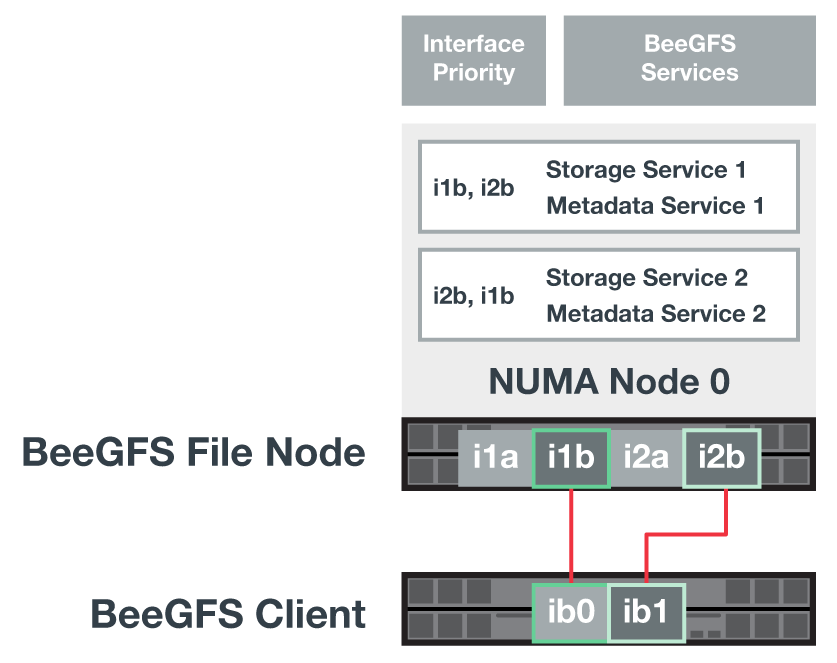
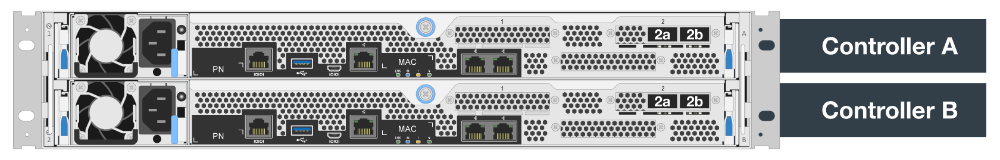
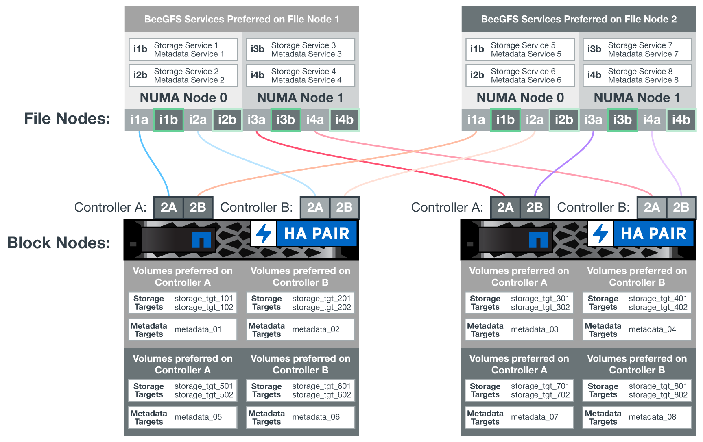
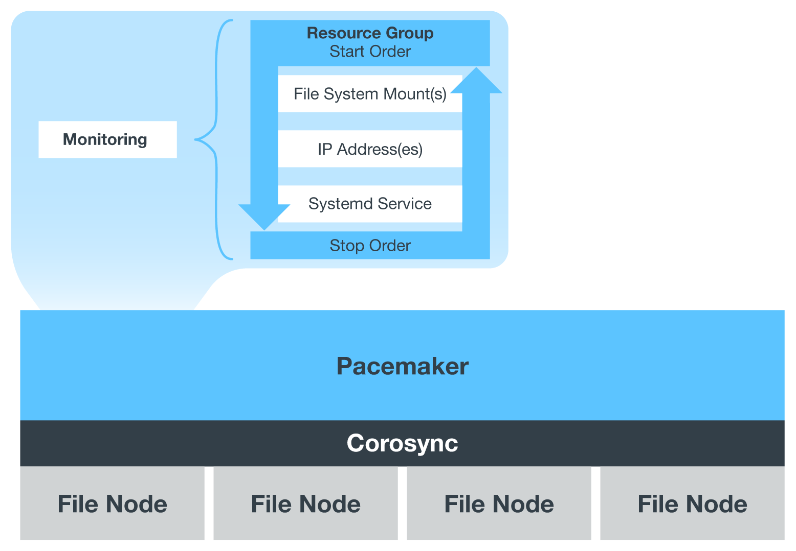

= 軟體組態
:hardbreaks:
:allow-uri-read: 
:nofooter: 
:icons: font
:linkattrs: 
:imagesdir: ./media/

[role="lead"]
NetApp上BeeGFS的軟體組態包括BeeGFS網路元件、EF600區塊節點、BeeGFS檔案節點、資源群組和BeeGFS服務。

== BeeGFS網路組態

BeeGFS網路組態包含下列元件。

* *浮動IP*浮動IP是一種虛擬IP位址、可動態路由傳送至同一個網路中的任何伺服器。多部伺服器可以擁有相同的浮動IP位址、但在任何指定時間、只能在一部伺服器上啟用。
+
每個BeeGFS伺服器服務都有自己的IP位址、可視BeeGFS伺服器服務的執行位置而在檔案節點之間移動。此浮動IP組態可讓每個服務獨立容錯移轉至其他檔案節點。用戶端只需知道特定BeeGFS服務的IP位址、就不需要知道目前執行該服務的檔案節點。

* * BeeGFS伺服器多重主頁組態*為了提高解決方案的密度、每個檔案節點都有多個儲存介面、其中IP設定在同一個IP子網路中。
+
需要額外的組態、以確保此組態能與Linux網路堆疊正常運作、因為在預設情況下、如果某個介面的IP位在同一子網路中、則可在不同的介面上回應對該介面的要求。除了其他缺點、這種預設行為也使得無法正確建立或維護RDMA連線。

+
Ansible型部署可處理反向路徑（RP）和位址解析傳輸協定（Arp）行為的強化、同時確保啟動和停止浮動IP；動態建立對應的IP路由和規則、讓多重主目錄網路組態正常運作。

* BeeGFS 用戶端多軌組態 * _Multi-rail 是指應用程式使用多個不同網路連線（或「 rail 」）來提高效能的能力。
+
BeeGFS 實作多軌支援、可在單一 IPoIB 子網路中使用多個 IB 介面。此功能可在 RDMA NIC 之間啟用動態負載平衡等功能、以最佳化網路資源的使用。它也與 NVIDIA GPUDirect 儲存設備（ GDS ）整合、可提供更高的系統頻寬、並減少用戶端 CPU 的延遲和使用率。

+
本文件提供單一 IPoIB 子網路組態的說明。支援雙 IPoIB 子網路組態、但並未提供與單一子網路組態相同的優勢。

+
下圖顯示多個BeeGFS用戶端介面之間的流量平衡。

+

+
由於BeeGFS中的每個檔案通常會跨越多個儲存服務進行等量分佈、因此多重軌道組態可讓用戶端達到比單一InfiniBand連接埠更高的處理量。例如、下列程式碼範例顯示通用的檔案分段組態、可讓用戶端在兩個介面之間平衡流量：

+
....
root@beegfs01:/mnt/beegfs# beegfs-ctl --getentryinfo myfile
Entry type: file
EntryID: 11D-624759A9-65
Metadata node: meta_01_tgt_0101 [ID: 101]
Stripe pattern details:
+ Type: RAID0
+ Chunksize: 1M
+ Number of storage targets: desired: 4; actual: 4
+ Storage targets:
  + 101 @ stor_01_tgt_0101 [ID: 101]
  + 102 @ stor_01_tgt_0101 [ID: 101]
  + 201 @ stor_02_tgt_0201 [ID: 201]
  + 202 @ stor_02_tgt_0201 [ID: 201]
....

== EF600區塊節點組態

區塊節點由兩個主動/主動式RAID控制器組成、可共用存取同一組磁碟機。一般而言、每個控制器擁有系統上設定的一半磁碟區、但可視需要接管其他控制器。

檔案節點上的多重路徑軟體可決定每個磁碟區的作用中最佳化路徑、並在纜線、介面卡或控制器故障時自動移至替代路徑。

下圖顯示EF600區塊節點中的控制器配置。

為了簡化共享磁碟HA解決方案、磁碟區會對應至兩個檔案節點、以便視需要彼此接管。下圖顯示如何設定BeeGFS服務和慣用磁碟區擁有權以達到最大效能的範例。每個BeeGFS服務左側的介面會指出用戶端和其他服務用來與其聯絡的偏好介面。

在前一個範例中、用戶端和伺服器服務偏好使用介面i1b與儲存服務1通訊。儲存服務1使用介面i1a做為首選路徑、以便在第一個區塊節點的控制器A上與其磁碟區（儲存設備_tgt_101、102）進行通訊。此組態可利用InfiniBand介面卡可用的全雙向PCIe頻寬、並從雙埠的HDRInfiniBand介面卡獲得比PCIe 4.0更好的效能。

== BeeGFS檔案節點組態

BeeGFS檔案節點已設定為高可用度（HA）叢集、以便在多個檔案節點之間進行BeeGFS服務的容錯移轉。

HA叢集設計是以兩個廣泛使用的Linux HA專案為基礎：叢集成員資格的電暈器同步、以及叢集資源管理的起搏器。如需更多資訊、請參閱 https://docs.redhat.com/en/documentation/red_hat_enterprise_linux/9/html/configuring_and_managing_high_availability_clusters/assembly_overview-of-high-availability-configuring-and-managing-high-availability-clusters["適用於高可用度附加元件的Red Hat訓練"^]。

NetApp撰寫並擴充數個開放式叢集架構（OCF）資源代理程式、讓叢集能夠智慧地啟動及監控BeeGFS資源。

== BeeGFS HA叢集

一般而言、當您啟動BeeGFS服務（無論是否有HA）時、必須有幾個資源：

* 可連線服務的IP位址、通常由Network Manager設定。
* 作為BeeGFS儲存資料目標的基礎檔案系統。
+
這些通常是在/etc/stab'中定義的、並由systemd掛載。

* 負責在其他資源準備就緒時啟動BeeGFS的系統服務。
+
如果沒有其他軟體、這些資源只會在單一檔案節點上啟動。因此、如果檔案節點離線、則無法存取BeeGFS檔案系統的一部分。

由於多個節點可以啟動每個BeeGFS服務、因此心臟起搏器必須確保每個服務和相依資源一次只能在一個節點上執行。例如、如果兩個節點嘗試啟動相同的BeeGFS服務、則如果兩個節點都嘗試寫入基礎目標上的相同檔案、就會有資料毀損的風險。為了避免這種情況、心臟起搏器必須仰賴電暈器同步、才能在所有節點之間可靠地保持整體叢集的狀態同步、並建立仲裁。

如果叢集發生故障、心臟起搏器會在另一個節點上反應並重新啟動BeeGFS資源。在某些情況下、心臟起搏器可能無法與原始故障節點通訊、以確認資源已停止。若要在重新啟動BeeGFS資源之前驗證節點是否已關閉、請先移除電源、使心臟起搏器從故障節點上關閉。

許多開放原始碼的屏障代理程式可讓心臟起搏器使用電力分配單元（PDU）或伺服器基板管理控制器（BMC）搭配API（例如RedfISH）來隔離節點。

當BeeGFS在HA叢集中執行時、所有BeeGFS服務和基礎資源都是由資源群組中的心臟起搏器管理。每個BeeGFS服務及其所依賴的資源都會設定成資源群組、以確保資源以正確的順序啟動和停止、並配置在同一個節點上。

對於每個BeeGFS資源群組、心臟起搏器都會執行自訂BeeGFS監控資源、負責偵測故障情況、並在特定節點上無法存取BeeGFS服務時、以智慧方式觸發容錯移轉。

下圖顯示由心臟起搏器控制的BeeGFS服務和相依性。

NOTE: 為了在同一個節點上啟動多個相同類型的BeeGFS服務、心臟起搏器已設定為使用多重模式組態方法來啟動BeeGFS服務。如需詳細資訊、請參閱 https://doc.beegfs.io/latest/advanced_topics/multimode.html["多重模式的BeeGFS文件"^]。

由於BeeGFS服務必須能夠在多個節點上啟動、因此每項服務的組態檔（通常位於「/etc/beegfs」）會儲存在其中一個E系列磁碟區上、作為該服務的BeeGFS目標。如此一來、可能需要執行服務的所有節點都能存取特定BeeGFS服務的組態和資料。

....
# tree stor_01_tgt_0101/ -L 2
stor_01_tgt_0101/
├── data
│   ├── benchmark
│   ├── buddymir
│   ├── chunks
│   ├── format.conf
│   ├── lock.pid
│   ├── nodeID
│   ├── nodeNumID
│   ├── originalNodeID
│   ├── targetID
│   └── targetNumID
└── storage_config
    ├── beegfs-storage.conf
    ├── connInterfacesFile.conf
    └── connNetFilterFile.conf
....