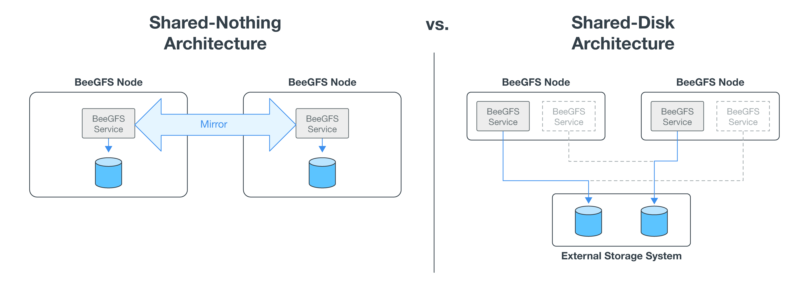

= 解決方案總覽
:hardbreaks:
:allow-uri-read: 
:nofooter: 
:icons: font
:linkattrs: 
:imagesdir: ./media/

[role="lead"]
BeeGFS on NetApp解決方案結合BeeGFS平行檔案系統與NetApp EF600儲存系統、打造可靠、可擴充且具成本效益的基礎架構、可跟上嚴苛工作負載的腳步。

此設計充分利用最新企業伺服器與儲存硬體及網路速度所提供的效能密度、 需要具備雙AMD EPYC 7003「Milan」處理器的檔案節點、並支援PCIe 4.0、並使用200GB（HDRs）InfiniBand直接連線至區塊節點、以使用NVMe/IB傳輸協定提供端點對端NVMe和NVMeoF。

== NVA方案

NetApp上的BeeGFS解決方案是NetApp驗證架構（NVA）方案的一部分、可為客戶提供特定工作負載和使用案例的參考組態和規模調整指導。NVA解決方案經過徹底測試與設計、可將部署風險降至最低、並加速上市時間。

== 使用案例

下列使用案例適用於NetApp上的BeeGFS解決方案：

* 人工智慧（AI）包括機器學習（ML）、深度學習（DL）、大規模自然語言處理（NLP）、以及自然語言理解（N5U）。如需詳細資訊、請參閱 https://www.netapp.com/blog/beefs-for-ai-fact-vs-fiction/["BeeGFS for AI：事實與虛構"^]。
* 高效能運算（HPC）、包括透過MPI（訊息傳遞介面）和其他分散式運算技術加速的應用程式。如需詳細資訊、請參閱 https://www.netapp.com/blog/beegfs-for-ai-ml-dl/["為什麼BeeGFS超越HPC"^]。
* 應用程式工作負載的特徵為：
+
** 讀取或寫入大於1GB的檔案
** 由多個用戶端（10s、100s和1000s）讀取或寫入同一個檔案

* 多TB或數PB資料集。
* 需要單一儲存命名空間的環境、可針對大型與小型檔案的組合進行最佳化。

== 效益

在NetApp上使用BeeGFS的主要優點包括：

* 通過驗證的硬體設計可提供完整的硬體與軟體元件整合、確保可預測的效能與可靠性。
* 使用Ansible進行部署與管理、以達到簡化與大規模一致的目標。
* 使用E系列效能分析器和BeeGFS外掛程式提供監控和觀察能力。如需詳細資訊、請參閱 https://www.netapp.com/blog/monitoring-netapp-eseries/["介紹監控NetApp E系列解決方案的架構"^]。
* 高可用度採用共享磁碟架構、提供資料持久性與可用度。
* 使用Container和Kubernetes支援現代化的工作負載管理與協調。如需詳細資訊、請參閱 https://www.netapp.com/blog/kubernetes-meet-beegfs/["Kubernetes與BeeGFS會面：這是一段符合未來需求的投資故事"^]。

== HA架構

NetApp的BeeGFS透過NetApp硬體打造完全整合的解決方案、實現共享磁碟高可用度（HA）架構、擴充BeeGFS企業版的功能。

NOTE: 雖然BeeGFS社群版本可以免費使用、但企業版需要向NetApp等合作夥伴購買專業支援訂閱合約。企業版允許使用多項額外功能、包括恢復能力、配額強制和儲存資源池。

下圖比較了共享無共享和共享磁碟HA架構。

如需詳細資訊、請參閱 https://www.netapp.com/blog/high-availability-beegfs/["發表NetApp支援的BeeGFS高可用度"^]。

== Ansible

NetApp上的BeeGFS是使用Ansible Automation（位於GitHub和Ansible Galaxis）（BeeGFS收藏可從取得）來交付及部署 https://galaxy.ansible.com/netapp_eseries/beegfs["Ansible Galaxy"^] 和 https://github.com/netappeseries/beegfs/["NetApp的E系列GitHub"^]）。雖然Ansible主要是針對用來組裝BeeGFS建置區塊的硬體進行測試、但您可以設定它在任何使用支援Linux套裝作業系統的x86型伺服器上執行。

如需詳細資訊、請參閱 https://www.netapp.com/blog/deploying-beegfs-eseries/["部署BeeGFS搭配E系列儲存設備"^]。
